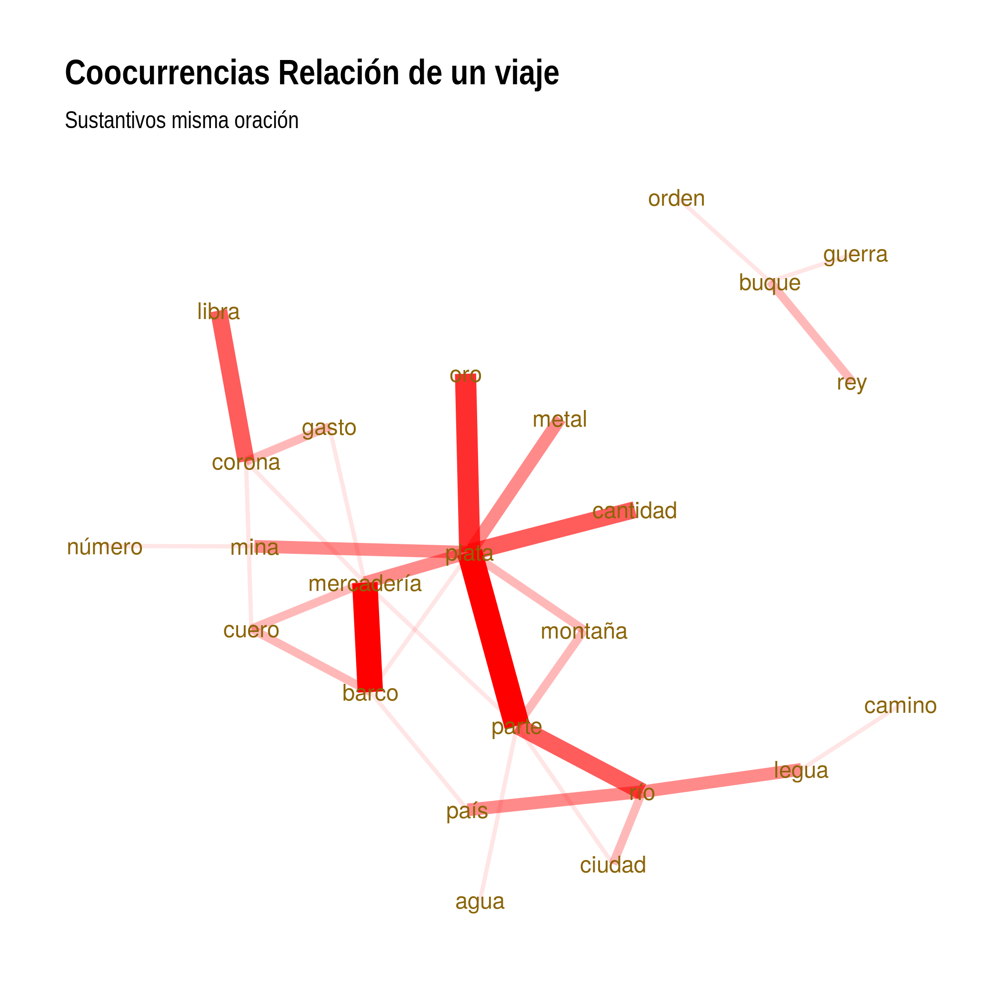
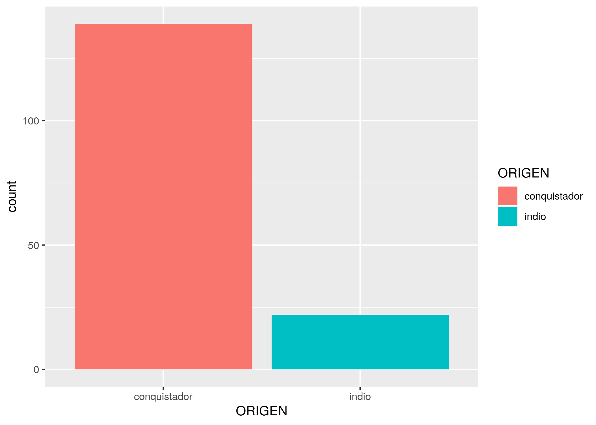
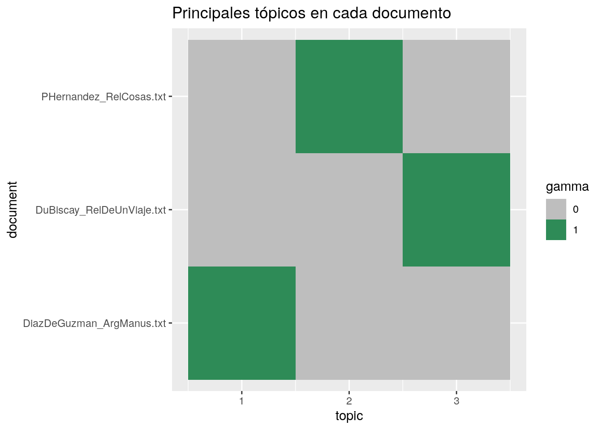
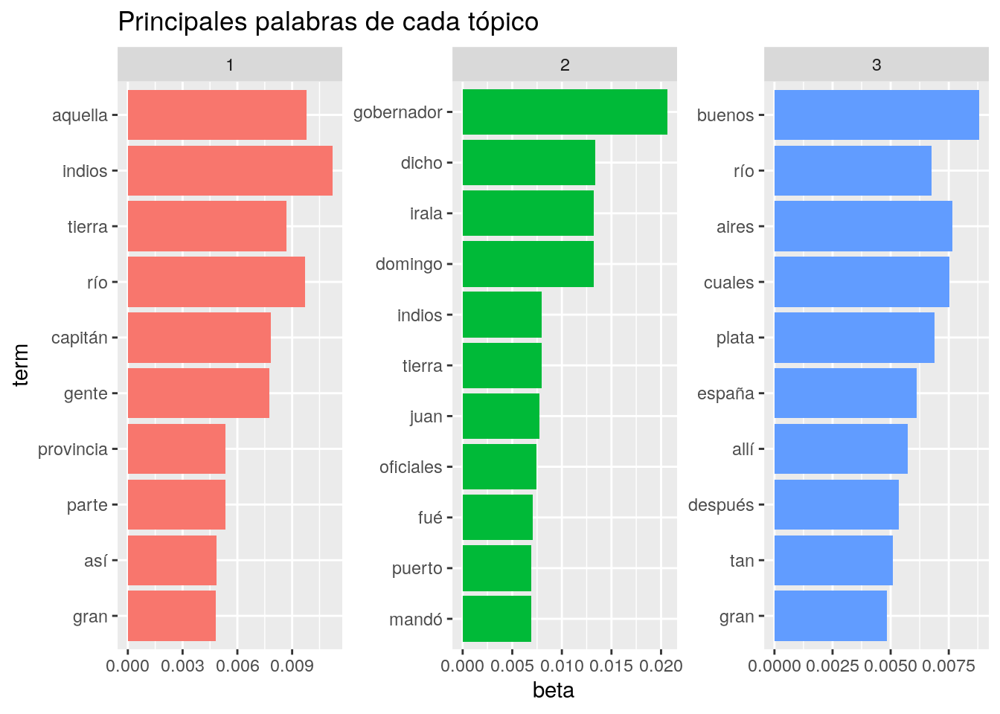
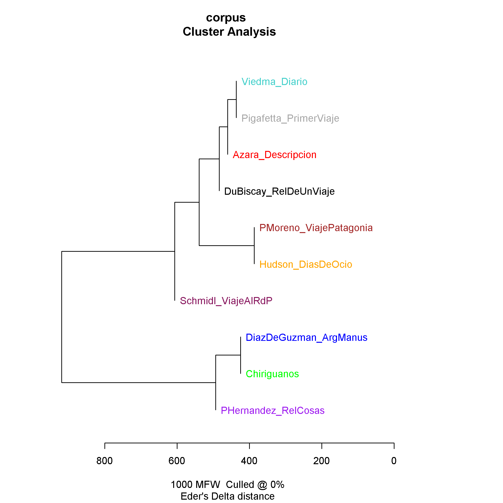
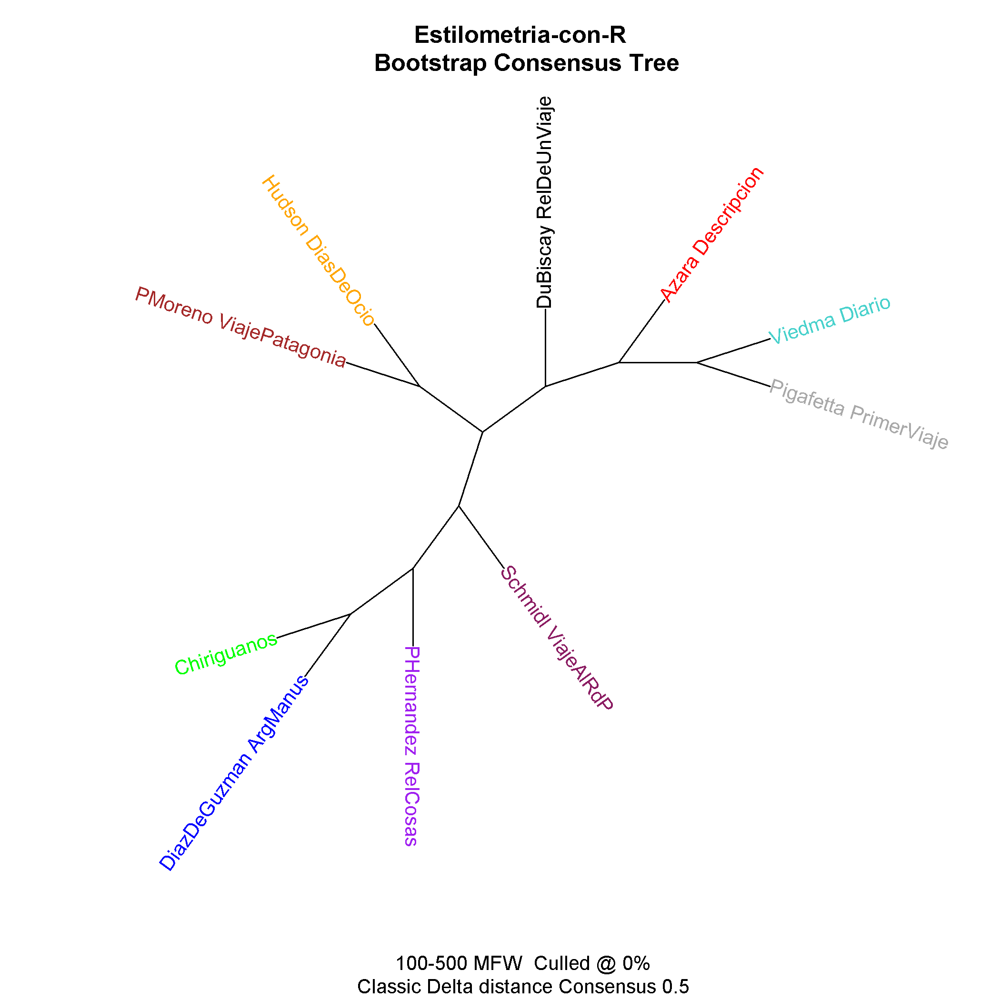

# Explora

La metodología del análisis textual digital presupone que los textos adquieren significado no de forma aislada, sino como un sistema, un gran corpus. En los grandes corpus textuales digitales pueden aparecen una y otra vez elementos que la lectura humana pasaría por alto al concentrarse únicamente en el detalle y lo lineal. El macroanálisis, la lectura maquínica o lectura distante, en palabras de Mathew Jockers, Stephen Ramsay o Franco Moretti, hace intervenir al elemento computacional y algorítmico y pone en juego métodos cuantitativos que no descartan los métodos cualitativos, pero donde la cantidad siempre precede a la calidad: primero las computadoras procesan datos y luego (idealmente) los humanos los leemos y entendemos en tanto texto.
Ofrecemos, a continuación, algunas experiencias de análisis textual en textos de nuestra Biblioteca Digital: La [_Relación de las cosas sucedidas en el Río de la Plata_](http://hdlabconicet.github.io/Relacion-de-las-cosas-sucedidas/) de Pero Hernández, la [_Relación de un viaje al Río de la Plata_](https://hdlab.space/Relacion-de-un-viaje/) de Acarete du Biscay, [_La Argentina Manuscrita_](https://hdlab.space/La-Argentina-Manuscrita/) de Ruy Díaz de Guzmán y [Argentina y la conquista del Río de la Plata](https://hdlab.space/argentina-y-conquista-del-rio-de-la-plata/) poema histórico de Martín del Barco Centenera, y Viaje al Río de la Plara de Ulrico Schmidel (Edición en proceso); sumamos a estos obras de autores que realizaron crónicas o relatos similares durantes los siglos XVI-XVIII. Ellos son:
* Félix de Azará (Descripción e Historia del Paraguay y del Río de la Plata)
* William H. Hudson (Días de ocio)
* Francisco Pascasio Moreno (Viaje a la Patagonia Austral)
* Antonio Pigafetta (Primer viaje alrededor del mundo)
* Antonio de Viedma (Diario de un viaje a la costa de Patagonia, para reconocer los puntos en donde establecer poblaciones)
* Ruy Díaz de Guzmán (Relación de la entrada de los Chiriguanos).

## Etiquetado morfosintáctico
El etiquetado morfosintáctico es un procedimiento de anotación automática que asigna una categoría gramatical (o parte del discurso, part-of-speech) a cada token de un texto. Esta técnica de permite visualizar dependencias sintácticas o investigar la correlación entre una determinada clase de palabras y otras características discursivas como polaridad de sentimientos o calidad de escritura.

## Análisis de coocurrencias
Las categorías gramaticales pueden utilizarse para el análisis de coocurrencias y así lograr una aproximación rápida del contenido de un corpus textual. El análisis de coocurrencias mide la aparición de dos o más tokens dentro de un mismo contexto (oración, párrafo, etc.). El cálculo de coocurrencias de sustantivos en la _Relación de un viaje al Río de la Plata_, ilustrado en el siguiente grafo, por ejemplo, permite comprender fácilmente la relevancia de la dimensión comercial y de la descripción del territorio en el texto de Acarete du Biscay a través de la alta frecuencia de los pares "barco-mercadería", "mina-plata", "corona-libra", en un caso, y "legua-río", "ciudad-río", "montaña-plata", en el otro.

## Etiquetado semántico
La anotación semántica normalmente busca distinguir las categorías de persona, lugar y evento. Pero también puede servirse de una taxonomía para identificar clases más específicas como [jerarquías profesionales](https://github.com/hdcaicyt/Relacion-de-las-cosas-sucedidas/blob/master/assets/taxonomia-personajes-pero-hernandez.pdf), divisiones administrativas o tipos de accidentes geográficos. 

Este enriquecimiento semántico permite, por ejemplo, contabilizar la cantidad de personajes según origen, facción o cargo o trazar los cruces entre estas categorías a lo largo de la trama textual, como en el siguiente [diagrama de narrativa](http://hdlab.space/Relacion-de-las-cosas-sucedidas/narrative-chart/) de [_Relación de las cosas sucedidas en el Río de la Plata_](http://hdlab.space/Relacion-de-las-cosas-sucedidas/):

## Topic modeling
El topic modeling es un método de organización de grandes corpus basado en aprendizaje automático. Esta técnica permite detectar los tópicos presentes en una colección textual, los documentos que responden a cada tópico y las palabras que lo representan sin necesidad de datos etiquetados.

El siguiente gráfico muestra las diez palabras más representativas de cada tópico para una experiencia de modelización de tópicos para _Relación de las cosas sucedidas_, _Relación de un viaje al Río de la Plata_ y _La Argentina Manuscrita_. El tópico 2 presenta palabras muy representativas de la _Relación de las cosas sucedidas_ (el texto da cuenta del enfrentamiento entre Domingo de Irala y el Gobernador, Álvar Núñez) y el tópico 1 muestra palabras como “capitán” y “pedro”, muy caractrísticas de _La Argentina Manuscrita_ (el texto relata la fundación de Asunción realizada por uno de los capitanes de Pedro de Mendoza). Es importante señalar que encontramos palabras repetidas entre tópicos (“río”, “indios”, “plata”), lo cual es lógico si tenemos en cuenta que los textos seleccionados tocan temas en común ya que todos tratan sobre la colonización de zona del Río de la Plata a fines del siglo XVI - principios del siglo XVII.

## Análisis estilométrico con paquete Stylo
La estilometría es el estudio cuantitativo del estilo lingüístico de textos escritos, cuyo objetivo principal es analizar características léxicas y gramaticales. Este campo tiene diversos usos, como la determinación de la autoría de una obra y la autenticidad de textos, la clasificación de documentos, la medición de frecuencias léxicas, la identificación de idiomas, entre otros. 
En este contexto, Maciej Eder, Jan Rybicki, Mike Kestemont y Steffen Pielstroem desarrollaron el paquete _Stylo_, para realizar análisis estilométrico en R. Esta librería combina el análisis estilístico textual con procedimientos estadísticos y presenta una interfaz gráfica propia. Entre sus características principales, destaca la facilidad para generar representaciones gráficas que consideran las distancias entre textos, permitiendo evaluar y visualizar similitudes o diferencias estilísticas.
Por ejemplo, los dendrogramas presentan los archivos de un corpus agrupados según su grado de cercanía estilística, mientras que los árboles de consenso ofrecen un agrupamiento más robusto al considerar estilos así como también autores diversos. Además, los métodos de oposición entre textos permiten clasificar distintos períodos o géneros, entre otras funciones.
En el siguiente gráfico:

El eje horizontal representa la distancia entre textos, que indica la relación estilística; el eje vertical se ajusta para optimizar la visualización de resultados, no obstante, su orientación es aleatoria, y la relación entre ambos es constante. En un dendograma, los textos que se grafican en una misma rama, poseen mayores similitudes estilísticas, mientras que las distancias mayores entre nodos reflejan diferencias estilísticas significativas. Es por ello, que en este análisis se pueden observar dos grandes ramas, en la superior se acercan determinados textos y autores, mientras que en la inferior, y más pequeña, se presenta un nodo que agrupa _La Argentina Manuscrita_ de Rui Díaz de Guzmán y un texto identificado como _Chiriguanos_, que corresponde a la “Relación de la entrada de los Chiriguanos” escrita por el mismo autor entre 1617 y 1618, publicada en 1979 por la Fundación Cultural Ramón Darío Gutiérrez. La separación entre las grandes ramas se debe a diferencias en las formas de escritura y el vocabulario usado por los autores. Al ajustar parámetros como la cantidad de MFW (Most Frequent Words), es decir, considerando solo 200 palabras más frecuentes de carácter gramatical, la separación entre las ramas principales puede volverse más precisa.
En otro análisis, representado por el siguiente gráfico:

El árbol de consenso confirma la autoría del texto _Chiriguanos_, al agruparlo junto a la otra obra de Díaz de Guzmán analizada. Este modelo es una herramienta poderosa para la estilometría, al facilitar la comparación y verificación de autorías.

[pelagios-site]: http://commons.pelagios.org/2017/08/pelagios-commons-al-sur-extending-pelagios-to-the-south-of-the-american-continent-2/
[pero-site]: http://hdlab.space/Relacion-de-las-cosas-sucedidas
[acarete-site]: http://hdlab.space/Relacion-de-un-viaje
[ruy-diaz-site]: http://hdlab.space/La-Argentina-Manuscrita/
